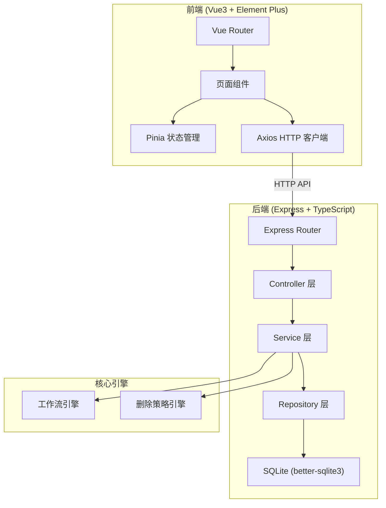
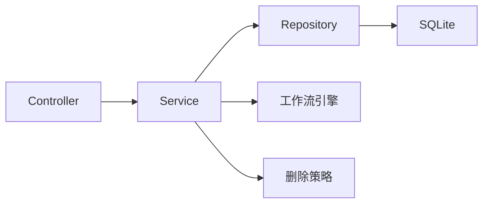
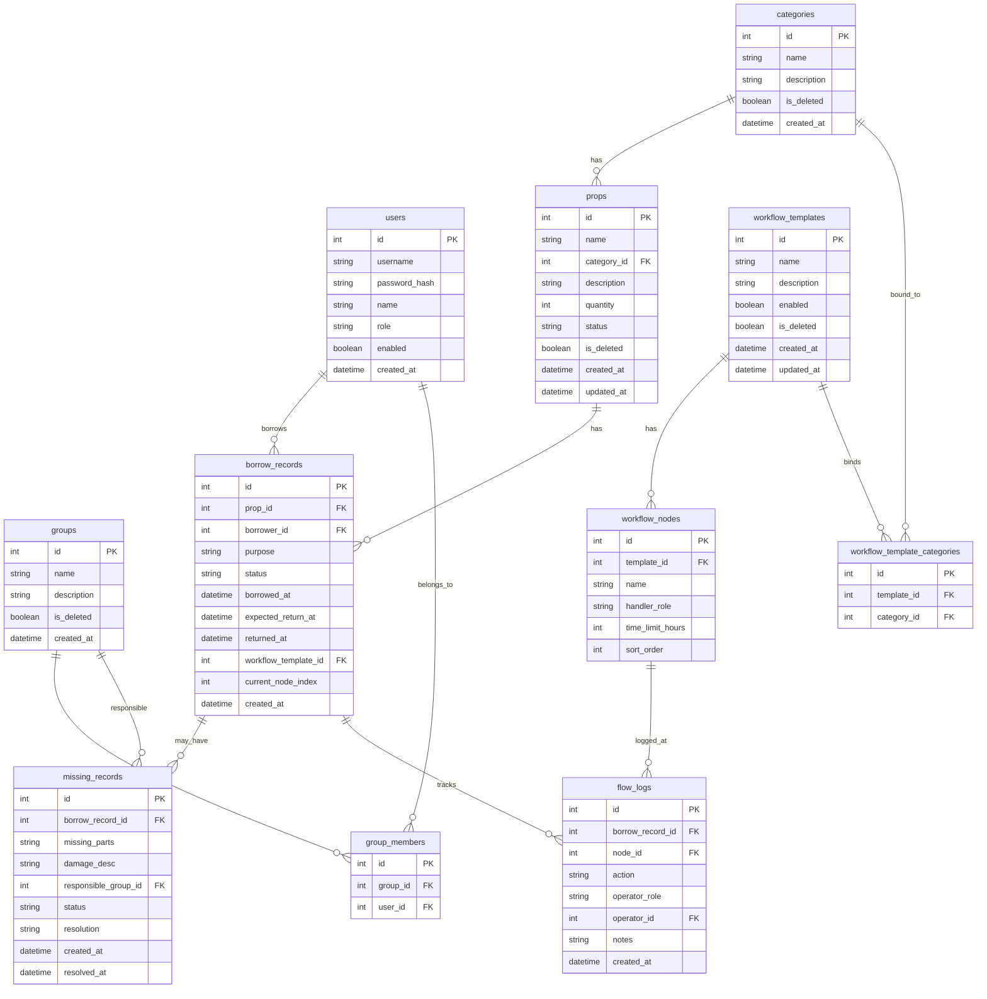

## 1. 架构设计



## 2. 技术说明

- 前端：Vue3 + TypeScript + Element Plus + Vue Router + Pinia + Axios
- 构建工具：Vite
- 后端：Express4 + TypeScript (ESM)
- 数据库：SQLite (better-sqlite3)
- 前端端口：8818
- 后端端口：8018
- 认证方式：JWT Token

## 3. 路由定义

| 路由 | 用途 |
|------|------|
| /login | 登录页 |
| /dashboard | 工作台首页 |
| /props | 道具列表页 |
| /props/create | 新增道具 |
| /props/:id | 道具详情/编辑 |
| /borrow | 借出登记页 |
| /return | 回收登记页 |
| /records | 借还记录页 |
| /warehouse/missing | 缺件处理页 |
| /warehouse/placement | 归位确认页 |
| /warehouse/inventory | 库存看板页 |
| /workflow | 流程模板列表 |
| /workflow/:id | 流程模板编辑 |
| /admin/users | 用户管理页 |
| /admin/groups | 责任小组页 |

## 4. API 定义

### 4.1 认证相关

```typescript
POST   /api/auth/login
  Request:  { username: string; password: string }
  Response: { token: string; user: User }

GET    /api/auth/me
  Headers: Authorization: Bearer <token>
  Response: { user: User }
```

### 4.2 道具管理

```typescript
GET    /api/props?page=1&pageSize=20&category=&status=&keyword=
  Response: { list: Prop[]; total: number }

GET    /api/props/:id
  Response: { prop: Prop; history: FlowRecord[] }

POST   /api/props
  Request:  { name: string; categoryId: number; description: string; quantity: number }
  Response: { prop: Prop }

PUT    /api/props/:id
  Request:  { name?: string; categoryId?: number; description?: string; quantity?: number }
  Response: { prop: Prop }

DELETE /api/props/:id?hard=false
  Response: { success: boolean; message: string }
```

### 4.3 借还管理

```typescript
POST   /api/borrow
  Request:  { propId: number; borrower: string; purpose: string; expectedReturnAt: string }
  Response: { record: BorrowRecord }

POST   /api/return
  Request:  { recordId: number; condition: "good" | "damaged" | "missing_parts"; notes?: string }
  Response: { record: BorrowRecord }

GET    /api/records?page=1&pageSize=20&status=&propId=&borrower=
  Response: { list: BorrowRecord[]; total: number }
```

### 4.4 仓库管理

```typescript
POST   /api/warehouse/missing
  Request:  { recordId: number; missingParts: string; damageDesc: string; responsibleGroupId?: number }
  Response: { missingRecord: MissingRecord }

PUT    /api/warehouse/missing/:id/resolve
  Request:  { resolution: string }
  Response: { missingRecord: MissingRecord }

POST   /api/warehouse/placement
  Request:  { recordId: number; confirmedBy: number }
  Response: { record: BorrowRecord }

GET    /api/warehouse/inventory
  Response: { categories: InventoryCategory[] }
```

### 4.5 工作流模板

```typescript
GET    /api/workflow/templates
  Response: { list: WorkflowTemplate[] }

GET    /api/workflow/templates/:id
  Response: { template: WorkflowTemplate }

POST   /api/workflow/templates
  Request:  { name: string; description: string; categoryIds: number[]; nodes: WorkflowNodeInput[] }
  Response: { template: WorkflowTemplate }

PUT    /api/workflow/templates/:id
  Request:  { name?: string; description?: string; categoryIds?: number[]; nodes?: WorkflowNodeInput[]; enabled?: boolean }
  Response: { template: WorkflowTemplate }

DELETE /api/workflow/templates/:id
  Response: { success: boolean }
```

### 4.6 系统管理

```typescript
GET    /api/admin/users
  Response: { list: User[] }

POST   /api/admin/users
  Request:  { username: string; password: string; role: "admin" | "reception" | "warehouse"; name: string }
  Response: { user: User }

PUT    /api/admin/users/:id
  Request:  { role?: string; name?: string; enabled?: boolean }
  Response: { user: User }

GET    /api/admin/groups
  Response: { list: Group[] }

POST   /api/admin/groups
  Request:  { name: string; description: string; memberIds: number[]; categoryIds: number[] }
  Response: { group: Group }

PUT    /api/admin/groups/:id
  Request:  { name?: string; description?: string; memberIds?: number[]; categoryIds?: number[] }
  Response: { group: Group }

DELETE /api/admin/groups/:id
  Response: { success: boolean }

GET    /api/admin/categories
  Response: { list: Category[] }

POST   /api/admin/categories
  Request:  { name: string; description: string }
  Response: { category: Category }

PUT    /api/admin/categories/:id
  Request:  { name?: string; description?: string }
  Response: { category: Category }

DELETE /api/admin/categories/:id
  Response: { success: boolean }
```

### 4.7 数据统计

```typescript
GET    /api/stats/dashboard
  Response: { pendingBorrow: number; pendingReturn: number; pendingMissing: number; pendingPlacement: number; recentActivities: Activity[] }
```

## 5. 服务器架构图



## 6. 数据模型

### 6.1 数据模型定义



### 6.2 数据定义语言

```sql
CREATE TABLE users (
    id INTEGER PRIMARY KEY AUTOINCREMENT,
    username TEXT NOT NULL UNIQUE,
    password_hash TEXT NOT NULL,
    name TEXT NOT NULL,
    role TEXT NOT NULL CHECK(role IN ('admin', 'reception', 'warehouse')),
    enabled INTEGER NOT NULL DEFAULT 1,
    created_at TEXT NOT NULL DEFAULT (datetime('now'))
);

CREATE TABLE categories (
    id INTEGER PRIMARY KEY AUTOINCREMENT,
    name TEXT NOT NULL,
    description TEXT DEFAULT '',
    is_deleted INTEGER NOT NULL DEFAULT 0,
    created_at TEXT NOT NULL DEFAULT (datetime('now'))
);

CREATE TABLE props (
    id INTEGER PRIMARY KEY AUTOINCREMENT,
    name TEXT NOT NULL,
    category_id INTEGER NOT NULL,
    description TEXT DEFAULT '',
    quantity INTEGER NOT NULL DEFAULT 1,
    status TEXT NOT NULL DEFAULT 'in_stock' CHECK(status IN ('in_stock', 'borrowed', 'checking', 'missing_parts', 'deleted')),
    is_deleted INTEGER NOT NULL DEFAULT 0,
    created_at TEXT NOT NULL DEFAULT (datetime('now')),
    updated_at TEXT NOT NULL DEFAULT (datetime('now')),
    FOREIGN KEY (category_id) REFERENCES categories(id)
);

CREATE TABLE groups (
    id INTEGER PRIMARY KEY AUTOINCREMENT,
    name TEXT NOT NULL,
    description TEXT DEFAULT '',
    is_deleted INTEGER NOT NULL DEFAULT 0,
    created_at TEXT NOT NULL DEFAULT (datetime('now'))
);

CREATE TABLE group_members (
    id INTEGER PRIMARY KEY AUTOINCREMENT,
    group_id INTEGER NOT NULL,
    user_id INTEGER NOT NULL,
    FOREIGN KEY (group_id) REFERENCES groups(id),
    FOREIGN KEY (user_id) REFERENCES users(id),
    UNIQUE(group_id, user_id)
);

CREATE TABLE workflow_templates (
    id INTEGER PRIMARY KEY AUTOINCREMENT,
    name TEXT NOT NULL,
    description TEXT DEFAULT '',
    enabled INTEGER NOT NULL DEFAULT 1,
    is_deleted INTEGER NOT NULL DEFAULT 0,
    created_at TEXT NOT NULL DEFAULT (datetime('now')),
    updated_at TEXT NOT NULL DEFAULT (datetime('now'))
);

CREATE TABLE workflow_template_categories (
    id INTEGER PRIMARY KEY AUTOINCREMENT,
    template_id INTEGER NOT NULL,
    category_id INTEGER NOT NULL,
    FOREIGN KEY (template_id) REFERENCES workflow_templates(id),
    FOREIGN KEY (category_id) REFERENCES categories(id),
    UNIQUE(template_id, category_id)
);

CREATE TABLE workflow_nodes (
    id INTEGER PRIMARY KEY AUTOINCREMENT,
    template_id INTEGER NOT NULL,
    name TEXT NOT NULL,
    handler_role TEXT NOT NULL CHECK(handler_role IN ('admin', 'reception', 'warehouse')),
    time_limit_hours INTEGER NOT NULL DEFAULT 24,
    sort_order INTEGER NOT NULL DEFAULT 0,
    FOREIGN KEY (template_id) REFERENCES workflow_templates(id)
);

CREATE TABLE borrow_records (
    id INTEGER PRIMARY KEY AUTOINCREMENT,
    prop_id INTEGER NOT NULL,
    borrower_id INTEGER NOT NULL,
    purpose TEXT DEFAULT '',
    status TEXT NOT NULL DEFAULT 'borrowed' CHECK(status IN ('borrowed', 'returned', 'checking', 'missing_parts', 'placed')),
    borrowed_at TEXT NOT NULL DEFAULT (datetime('now')),
    expected_return_at TEXT,
    returned_at TEXT,
    workflow_template_id INTEGER,
    current_node_index INTEGER NOT NULL DEFAULT 0,
    created_at TEXT NOT NULL DEFAULT (datetime('now')),
    FOREIGN KEY (prop_id) REFERENCES props(id),
    FOREIGN KEY (borrower_id) REFERENCES users(id),
    FOREIGN KEY (workflow_template_id) REFERENCES workflow_templates(id)
);

CREATE TABLE missing_records (
    id INTEGER PRIMARY KEY AUTOINCREMENT,
    borrow_record_id INTEGER NOT NULL,
    missing_parts TEXT NOT NULL,
    damage_desc TEXT DEFAULT '',
    responsible_group_id INTEGER,
    status TEXT NOT NULL DEFAULT 'pending' CHECK(status IN ('pending', 'processing', 'resolved')),
    resolution TEXT DEFAULT '',
    created_at TEXT NOT NULL DEFAULT (datetime('now')),
    resolved_at TEXT,
    FOREIGN KEY (borrow_record_id) REFERENCES borrow_records(id),
    FOREIGN KEY (responsible_group_id) REFERENCES groups(id)
);

CREATE TABLE flow_logs (
    id INTEGER PRIMARY KEY AUTOINCREMENT,
    borrow_record_id INTEGER NOT NULL,
    node_id INTEGER,
    action TEXT NOT NULL,
    operator_role TEXT NOT NULL,
    operator_id INTEGER NOT NULL,
    notes TEXT DEFAULT '',
    created_at TEXT NOT NULL DEFAULT (datetime('now')),
    FOREIGN KEY (borrow_record_id) REFERENCES borrow_records(id),
    FOREIGN KEY (node_id) REFERENCES workflow_nodes(id),
    FOREIGN KEY (operator_id) REFERENCES users(id)
);

-- 索引
CREATE INDEX idx_props_category ON props(category_id);
CREATE INDEX idx_props_status ON props(status);
CREATE INDEX idx_borrow_records_prop ON borrow_records(prop_id);
CREATE INDEX idx_borrow_records_status ON borrow_records(status);
CREATE INDEX idx_borrow_records_borrower ON borrow_records(borrower_id);
CREATE INDEX idx_missing_records_borrow ON missing_records(borrow_record_id);
CREATE INDEX idx_missing_records_status ON missing_records(status);
CREATE INDEX idx_flow_logs_record ON flow_logs(borrow_record_id);

-- 初始管理员数据
INSERT INTO users (username, password_hash, name, role, enabled) VALUES ('admin', 'hashed_admin_123', '系统管理员', 'admin', 1);
INSERT INTO users (username, password_hash, name, role, enabled) VALUES ('reception', 'hashed_reception_123', '接待人员', 'reception', 1);
INSERT INTO users (username, password_hash, name, role, enabled) VALUES ('warehouse', 'hashed_warehouse_123', '仓库人员', 'warehouse', 1);
```
